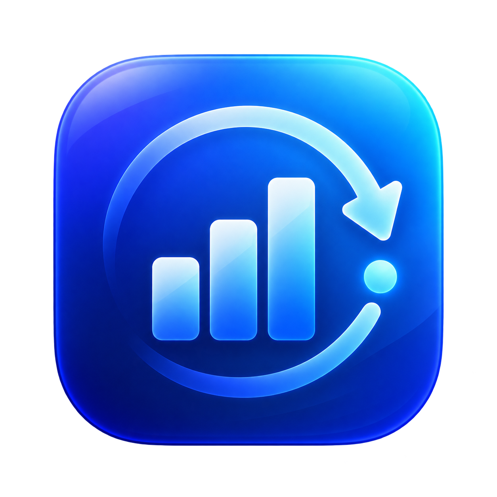
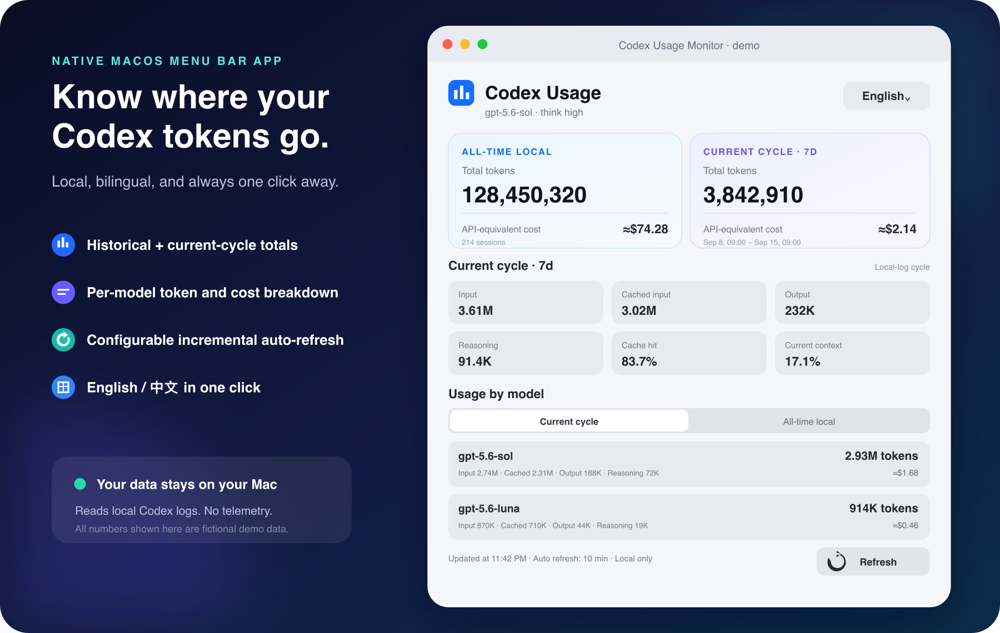

<p align="center">
  
</p>

<h1 align="center">Codex Usage Monitor</h1>

<p align="center">
  <strong>English</strong> · <a href="README.zh-CN.md">简体中文</a>
</p>

<p align="center">
  A private, one-click view of your Codex tokens, rolling cycle, models, cache efficiency, and API-equivalent cost.
</p>

<p align="center">
  
  
  
  <a href="LICENSE"></a>
  
</p>

<p align="center">
  <strong>Native macOS menu bar app · Codex Desktop card · CLI · Stop hooks</strong><br>
  English / 中文 · configurable auto-refresh · limit alerts · fast incremental scans
</p>



> The preview uses fictional data. The app reads your local Codex logs and does not send usage data anywhere.

## Why use it?

Codex shows useful information for the current task, but it is hard to answer broader questions such as “How much have I used this rolling cycle?” or “Which model accounts for most of my tokens?” Codex Usage Monitor makes those answers available from the menu bar without opening another dashboard.

| At a glance | What you get |
| --- | --- |
| **Optional all-time usage** | Enable it when needed; the slower full-history calculation runs in the background and its aggregate is reused across launches. |
| **Current rolling cycle** | Tokens since the start of the longest active Codex limit window, normally 7 days. |
| **Token breakdown** | Input, cached input, output, reasoning, cache hit rate, and current context fill. |
| **Usage by model** | Per-model totals, token composition, and estimated API-equivalent cost for the current cycle or all time. |
| **Rolling limits** | Usage percentage and reset time for every limit reported in local logs. |
| **Fast refresh** | Current-cycle data is scanned first; the last aggregate snapshot appears immediately and active logs are read incrementally. |
| **Useful alerts** | Optionally notify at 50%, 75%, or 90% of a rolling limit, once per limit window. |
| **Mac-native controls** | Launch at login, refresh after wake, bilingual UI, and a safe fictional-data demo mode. |

## Quick start on macOS

Download the latest open-source build from [GitHub Releases](https://github.com/wentao-uw/codex-usage-monitor/releases/latest), or build it yourself on macOS 13 or newer with Xcode Command Line Tools:

```bash
git clone https://github.com/wentao-uw/codex-usage-monitor.git
cd codex-usage-monitor
npm run build:macos
open "dist/Codex Usage Monitor.app"
```

Click the chart icon in the macOS menu bar. Current-cycle usage is shown first. The app saves only an aggregate snapshot, so later launches can render immediately while a due refresh runs in the background.

Use the interval menu in the footer to choose **Off, 1, 5, 10, 15, 30, or 60 minutes**. The selection is saved automatically, and manual refresh remains available at any time. Opening the menu after a while or waking the Mac also refreshes stale data.

All-time history is disabled by default because it requires a wider scan. Enable **Calculate all-time usage** in **Settings** when you need it; calculation runs at background priority, is cached across launches, and is refreshed at most once per day unless you explicitly choose **Recalculate history**. Settings also contains launch at login, rolling-limit notifications, demo mode, and the manual update check.

Release builds are ad-hoc signed for transparent open-source distribution and are not Developer ID notarized. Depending on your Gatekeeper settings, the first launch may require Control-clicking the app and choosing **Open**.

## What the numbers mean

- **All-time local** is the latest cumulative token total from each session found under `~/.codex/sessions` and `~/.codex/archived_sessions`.
- **Current cycle** sums timestamped usage since the start of the longest rolling-limit window currently present in your logs. When both 5-hour and 7-day limits exist, the cycle uses the 7-day window.
- **API-equivalent cost** estimates what the same token mix would cost at API list prices. It is not your Codex subscription bill.
- **Cached input** remains part of the total token count, but uses the cached-input price when a model has one.
- A `≥` cost means at least one detected model is missing from the bundled pricing table, so the known-model subtotal is shown instead of pretending the unknown model was free.

These are local-log totals. They can differ from account-wide usage when you use Codex on another Mac, in the cloud, or in an environment whose logs are not stored here.

## Privacy by design

- Reads Codex JSONL session files locally.
- Makes no background network requests and sends no logs, tokens, or account data anywhere.
- Contacts GitHub's public Releases API only when you explicitly choose **Check for Updates**.
- Includes no telemetry or analytics SDK.
- Stores refresh preferences and notification de-duplication in macOS user defaults, plus an aggregate-only usage snapshot under Application Support for instant startup. Raw session contents are not copied into the cache.
- Does not need your OpenAI API key.

You can inspect the scanner in [`UsageScanner.swift`](macos/CodexUsageMenuBar/Sources/UsageCore/UsageScanner.swift) and the Node parser in [`session.js`](lib/session.js).

## Also works inside Codex and the terminal

The repository is both a native macOS app and a zero-dependency Codex plugin. Install it in your personal plugin directory:

```bash
git clone https://github.com/wentao-uw/codex-usage-monitor.git \
  ~/.codex/plugins/codex-usage-monitor
```

Start a new Codex task, mention **Codex Usage Monitor**, or ask:

```text
Show my Codex usage.
```

The bundled local MCP app renders an inline usage card. Clients without MCP Apps support still receive a readable text summary.

### CLI

```bash
node ~/.codex/plugins/codex-usage-monitor/bin/codex-usage-monitor.js summary
node ~/.codex/plugins/codex-usage-monitor/bin/codex-usage-monitor.js statusline
node ~/.codex/plugins/codex-usage-monitor/bin/codex-usage-monitor.js watch --interval 60
```

Available commands:

```text
codex-usage-monitor summary [--file session.jsonl]
codex-usage-monitor statusline [--file session.jsonl]
codex-usage-monitor json [--file session.jsonl]
codex-usage-monitor watch [--interval 5]
codex-usage-monitor doctor
```

| Option | Effect |
| --- | --- |
| `--file PATH` | Read one Codex session JSONL file. |
| `--codex-home PATH` | Override `CODEX_HOME` or `~/.codex`. |
| `--ascii` | Use ASCII progress bars. |
| `--no-color` | Disable ANSI color. |

### Hooks

The bundled `Stop` hook prints a compact usage box after each completed turn. A throttled `PostToolUse` hook can also show progress during long tasks. Both only read local files and do not consume model quota.

Useful environment variables:

| Variable | Effect |
| --- | --- |
| `CODEX_USAGE_MONITOR_ASCII=1` | Use ASCII bars in all output. |
| `CODEX_USAGE_MONITOR_NO_COLOR=1` | Disable ANSI color. |
| `CODEX_USAGE_MONITOR_QUIET=1` | Silence the Stop-hook summary. |
| `CODEX_USAGE_MONITOR_HOOK_INTERVAL_SECONDS=N` | Throttle completed-turn summaries. |
| `CODEX_USAGE_MONITOR_WORK_INTERVAL_SECONDS=N` | Throttle work-in-progress summaries; default is 300 seconds. |
| `CODEX_USAGE_MONITOR_DIRECT_TTY=0` | Disable direct terminal writes from hooks. |
| `CODEX_USAGE_MONITOR_MAX_BYTES=N` | Skip transcript files larger than `N` bytes; default is 50 MB. |

## Development

The CLI and plugin use only Node.js built-ins, so there is no dependency-install step.

```bash
npm test
npm run test:macos
npm run build:macos
```

The macOS build is written to `dist/Codex Usage Monitor.app` and ad-hoc signed for local use. Tagged versions are tested and packaged by GitHub Actions without Developer ID or notarization steps. See [`docs/DESIGN.md`](docs/DESIGN.md) for the architecture and [`CONTRIBUTING.md`](CONTRIBUTING.md) for contribution guidance.

## Pricing updates

Rates live in [`lib/pricing.js`](lib/pricing.js). When API pricing changes, update the table, its snapshot date, and the pricing tests together. Unknown models are deliberately surfaced as incomplete estimates.

## License

[MIT](LICENSE)

This is an independent, unofficial project. It is not affiliated with or endorsed by OpenAI.
